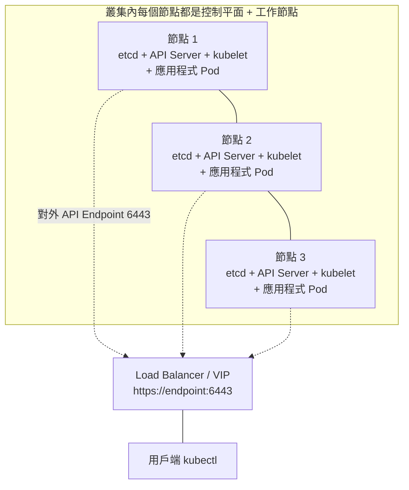

# Talos Linux 三節點叢集安裝指南（新手版，從單節點 k3s 轉換）

## 前言：為什麼這個指南為你而寫

你先前使用的是**單節點 k3s**：在一台常見的 Linux 系統上安裝 k3s 二進位檔，執行 `k3s server` 就馬上得到一個可用的 Kubernetes 叢集。你可以 SSH 進系統、裝套件、直接改設定檔，感覺就像「管理一台跑著 Kubernetes 的 Linux 伺服器」。

**Talos Linux 是完全不同的典範**：它是一套「專門為了 Kubernetes 而生」的作業系統，而不是「被拿來跑 Kubernetes 的作業系統」[^philosophy]。它沒有 SSH、沒有 shell、沒有套件管理器，整台機器的狀態完全由一份 YAML 設定檔定義，可以透過 `talosctl` 這支 CLI 以宣告式 API 管理[^philosophy]。因此，如果你帶著 k3s 的習慣（SSH 進去看 `journalctl`、開 `htop`）來操作 Talos，會處處碰壁。這份指南假設你**從零開始**接觸 Talos，重點教你怎麼把 3 台機器組成一個 HA（高可用）Kubernetes 叢集。

三個節點的角色配置如下圖：**每台節點同時是控制平面（跑 etcd + API Server）也是工作節點（會承載一般應用程式 Pod）**，這是小規模叢集善用硬體的常見做法：



> 註：本文假設你要搭建的是**生產用途、3 個節點全部既是控制平面也是工作節點**的 HA 叢集。原本 Talos 預設會對控制平面套上 `node-role.kubernetes.io/control-plane: NoSchedule` taint，**阻止使用者應用程式被排程上去**；因為你的每一台都要跑應用程式，必須在產生設定時關掉這個 taint（見第 4 節）。

---

## 1. 概念差異速覽：k3s vs Talos

| 面向 | k3s（你熟悉） | Talos Linux |
|---|---|---|
| 作業系統 | 任何一般 Linux（Ubuntu/Debian…） | 特製、不可變的迷你 OS（< 80 MB SquashFS）[^philosophy] |
| 管理方式 | SSH + 修改設定檔 | **無 SSH、無 shell**，只能用 `talosctl` API[^philosophy] |
| 設定來源 | k3s 參數/旗標 + 系統套件 | 單一 YAML「machine config」，整台機器完全由它定義[^gs] |
| 資料庫 | 預設 SQLite（單節點）或內建 etcd | **一律使用 etcd**[^compare] |
| 預設 CNI | 內建 Flannel | 預設 Flannel，也可換成 Cilium/Calico[^gs] |
| 建立叢集 | 執行 `k3s server` 立刻完成 | 需逐步：開機 → 產生設定 → 套用設定 → 手動 `bootstrap`[^gs] |
| 升級 | 取代二進位檔並重啟服務 | `talosctl upgrade`，A/B 映像、內建自動回復[^upgrade] |
| 心智模型 | 「我管理一台跑 K8s 的伺服器」 | 「我管理一個叢集，節點是可丟棄、可重新建立的」[^compare] |

**最重要的三個心態轉變**[^compare]：

1. **不要再想 SSH**：所有操作都透過 `talosctl`。除錯用 `talosctl logs`、`talosctl dashboard`、`talosctl dmesg`，取代過去的 `journalctl`、`htop`。
2. **設定是宣告式的**：你永遠不去 edit 執行中的節點，而是改 YAML 再 `talosctl apply-config`。
3. **節點是可拋棄的**：壞了就 wipe 重灌同一份設定，不要「溺愛」任何一台機器。

---

## 2. 準備工作（Prerequisites）

### 硬體需求[^sysreq]

| 節點角色 | 最低記憶體 | 最低核心 | 建議記憶體 | 建議核心 | 建議系統碟 |
|---|---|---|---|---|---|
| 控制平面兼工作節點（3 台皆同） | 2 GiB | 2 | **4 GiB 以上** | **4 以上** | 100 GiB |

因為控制平面會額外吃資源跑 etcd、API Server 等元件，**同時又**要承載應用程式，建議以控制平面的規格為基準並酌予提高（尤其記憶體），避免應用程式把控制平面資源吃光[^sysreq]。

**CPU 注意**：Talos 的 amd64 映像需要 **x86-64-v2** 微架構等級。舊 CPU（例如 Proxmox 的 `kvm64`）會在開機時停住無法啟動[^sysreq]。

### 網路需求[^gs]

- 3 台節點都需要**對外網路連線**，才能拉取 installer/container 映像並查詢 NTP。
- 你的工作機需要能以 **TCP port 50000** 直接連到節點（初次套用設定時需要，這就是 Talos API）。

### 安裝 `talosctl`（Linux）[^talosctl]

```bash
curl -sL https://talos.dev/install | sh
```

（macOS 可以使用 `brew install siderolabs/tap/talosctl`。)

> ⚠️ **重要**：`talosctl` 的版本會決定裝到節點上的 **Talos Linux 版本**（不是開機 ISO 的版本）。請讓 `talosctl` 與你要安裝的 Talos 版本一致[^gs]。

---

## 3. 從 Image Factory 開機 Talos ISO

到 [Image Factory](https://factory.talos.dev/) 下載 Talos ISO，並用它開機 **3 台**機器。**3 台全部都要當控制平面**（也會跑工作負載）。

當 ISO 開機後，Talos 會**跑在 RAM** 中並停留在「maintenance mode」等待設定，它**不會**自行安裝到磁碟，直到你套用 machine config 為止[^gs]。

---

## 4. 產生 Machine Config

在你的工作機上執行：

```bash
talosctl gen config my-cluster https://<endpoint>:6443
```

`<endpoint>` 是 Kubernetes API 的位址（**預設 port 6443**）[^gs]。這個指令會產生 **3 個檔案**[^gs]：

| 檔案 | 用途 |
|---|---|
| `controlplane.yaml` | 控制平面節點的 machine config |
| `worker.yaml` | 工作節點的 machine config |
| `talosconfig` | 你的本機 `talosctl` 用戶端認證設定 |

### 4.a 選擇 HA Endpoint（非常重要）

因為要 HA，`<endpoint>` 不能只指向單一台控制平面，否則那台掛了整個叢集就失聯。有三個推薦做法，選一個[^prod]：

1. **專用 TCP Load Balancer**：把 frontend 設在 `6443`，backend 指向 3 台控制平面。**注意只能用 TCP L4**，因為 Kubernetes API Server 自己做 TLS，不能用 HTTP (L7)。
2. **Talos 內建 Layer 2 VIP**：在同一個 subnet 挑一個沒被 DHCP 用到的閒置 IP（例如 `192.168.0.15`），之後在 `controlplane.yaml` 裡設定 VIP（見第 5.2 節）。Endpoint 用 `https://192.168.0.15:6443`。
3. **多筆 DNS 記錄**：DNS 給同一個 hostname 對應 3 台控制平面的 IP，這讓 kubectl 自動做 client 端 load balance。

> ⚠️ **重要警告**：內建 VIP **不要**用來存取 Talos API（port 50000）。如果 etcd 掛了，VIP 會停止運作，你就失去透過 API 救援的能力[^prod]。

### 4.b 進階：先產生 secrets bundle（建議）

生產環境建議用 secrets bundle 產生存活檔，日後可用它重現 machine config[^prod]：

```bash
talosctl gen secrets -o secrets.yaml
talosctl gen config --with-secrets secrets.yaml my-cluster https://<endpoint>:6443
```

請把 `secrets.yaml` 妥善保管（它有權限重建整個叢集的設定）。想指定 Kubernetes 版本就加上 `--kubernetes-version 1.25.4`[^prod]。

### 4.c 磁碟檢查與修改

如果預設磁碟不正確，先檢查可用磁碟：

```bash
talosctl get disks --insecure -n <NODE_IP>
```

然後編輯 `controlplane.yaml`（本情境只用這份；`worker.yaml` 雖然也會產生，但用不到）的這一段[^gs]：

```yaml
install:
  disk: /dev/sda   # 改成實際裝置，例如 /dev/vda
```

### 4.d 讓控制平面也能跑工作負載（關鍵步驟）

因為你的 3 台節點同時也要當工作節點，必須移除控制平面預設的 taint，否則應用程式 Pod 排不上去。最乾淨的作法是**在產生設定的時候**就打 patch[^taint]：

先建立一個 patch 檔（例如 `allow-scheduling-on-cp.yaml`）：

```yaml
cluster:
  allowSchedulingOnControlPlanes: true
```

然後在 `gen config` 時套用 patch：

```bash
talosctl gen config --with-secrets secrets.yaml my-cluster https://<endpoint>:6443 \
  --config-patch-control-plane @allow-scheduling-on-cp.yaml
```

這會讓 Talos 在 bootstrap 時**不**對控制平面套上 `node-role.kubernetes.io/control-plane: NoSchedule` taint，控制平面節點就能像工作節點一樣承載一般 Pod[^taint]。

> **小叢集建議**：對 1–3 節點的叢集，讓控制平面承載工作負載是常見且務實的做法，以善用有限的硬體資源。如果之後想恢復正統的「控制平面只專心管叢集」，直接把 taint 加回去、讓工作負載改跑到專屬 worker 節點即可[^taint]。

你可以用下列 kubectl 指令檢查 taint 是否真的清掉了：

```bash
kubectl get nodes -o jsonpath='{.items[*].spec.taints}'
```

---

## 5. 套用設定到三台節點

你必須能**直接**連到每台節點的 TCP port 50000。因為 PKI 還沒建立，這裡要用 `--insecure`，且**不能用 endpoint 必須直接指定 node**（insecure 模式下無法用 endpoint proxy）[^gs]。

### 5.1 套用三份設定

```bash
# 節點 1（控制平面 + 工作負載）
talosctl apply-config --insecure --nodes 192.168.0.2 --file controlplane.yaml

# 節點 2、3
talosctl apply-config --insecure --nodes 192.168.0.3 --file controlplane.yaml
talosctl apply-config --insecure --nodes 192.168.0.4 --file controlplane.yaml
```

> 注意：因為三台都是控制平面，一律套用 `controlplane.yaml`；本情境不會用到 `worker.yaml`。

每台節點套用後會重新開機，並從 RAM 正式安裝到磁碟[^gs]。

### 5.2 若使用內建 VIP（選用）

如果你選了方案 2（VIP），在套用前先編輯 `controlplane.yaml`，在每台控制平面的 network 區段加入[^prod]：

```yaml
machine:
  network:
    interfaces:
      - interface: enp2s0   # 改成實際網卡名稱
        dhcp: true
        vip:
          ip: 192.168.0.15
```

Endpoint 就用 `https://192.168.0.15:6443`。

### 5.3 多介面節點（選用）

若節點有多張網卡，告訴 etcd 該用哪個 subnet 的位址做 member 間溝通[^prod]：

```yaml
cluster:
  etcd:
    advertisedSubnets:
      - 192.168.0.0/16
```

---

## 6. Bootstrap 叢集

**這一步只能呼叫一次，且只能在「單一台」控制平面節點上執行**。它會[^gs]：

- 建立跨三台節點的 **etcd 叢集**
- 產生所有核心 Kubernetes 資產
- 啟動 Kubernetes 控制平面元件（以 static pod 形式）

```bash
talosctl bootstrap --nodes 192.168.0.2 --endpoints 192.168.0.2 \
  --talosconfig=./talosconfig
```

> 說明：`--endpoints`（`-e`）是 `talosctl` **送出指令**的控制平面位置（port 50000，可多個做 client 端平衡）；`--nodes`（`-n`）是該指令**作用於**的目標節點，endpoints 會 proxy 到 nodes[^talosctl]。

等待幾分鐘讓完成，然後取得 kubeconfig：

```bash
talosctl kubeconfig --nodes 192.168.0.2 --endpoints 192.168.0.2 \
  --talosconfig=./talosconfig
```

驗證：

```bash
kubectl get nodes
talosctl --nodes 192.168.0.2 --endpoints 192.168.0.2 health --talosconfig=./talosconfig
```

---

## 7. 日常使用與設定 `talosctl`

把三台控制平面加入 endpoint 做 client 端 load balance / failover，並把設定 merge 進 `~/.talos/config`[^prod]：

```bash
talosctl --talosconfig=./talosconfig config endpoint 192.168.0.2 192.168.0.3 192.168.0.4
talosctl config merge ./talosconfig
```

> ⚠️ 不要在全域設定裡預設 `--nodes`，每個指令都應該明確指定 `--nodes`[^prod]。

常用指令範例：

```bash
# 透過任一控制平面去查看某台工作節點（端點:控制平面；節點:目標）
talosctl -e 192.168.0.2 -n 192.168.0.200 containers

# 同時查看多台的 etcd 狀態
talosctl -e 192.168.0.2 -n 192.168.0.2,192.168.0.3,192.168.0.4 etcd status

# 即時儀表板（取代 htop）
talosctl -n <NODE_IP> dashboard
```

---

## 8. 備份、升級與維護

### 8.1 備份

定期備份 **etcd 資料庫**，完整作法見官方災難復原指南[^disaster]。

### 8.2 升級 Talos OS

**升級路徑**：必須依序經過每個中間 minor release（例如 1.0 → 1.0.6 → 1.1.2 ），不可跨跳[^upgrade]。

```bash
# 升級單一台控制平面（換成實際 installer 映像版本）
talosctl upgrade --nodes 192.168.0.2 \
  --image ghcr.io/siderolabs/installer:v1.9.0
```

**三節點叢集請一次只升一台**。Talos 會保護 etcd quorum：若升級會造成 quorum 遺失，它會**拒絕**升級；同時也防止多台控制平面同時升級[^prod][^upgrade]。

升級時 Talos 會自動：cordon → drain workloads → 關閉內部程序（含控制平面的 etcd）→ 離開 etcd membership（確保叢集健康）→ 卸載檔案系統 → 套用新映像 → 以 `kexec` 重新開機 → 重新加入叢集並 uncordon[^upgrade]。

有內建自動回復：若新核心/映像開機失敗，bootloader 會回到前一個版本。也可手動：

```bash
talosctl rollback --nodes 192.168.0.2
```

### 8.3 升級 Kubernetes

Talos 從 v1.0 起，**OS 升級與 Kubernetes 升級是分開的**。自動方法[^k8s]：

```bash
# 先 dry-run 看會改什麼
talosctl upgrade-k8s --dry-run --to v1.30.0

# 實際升級（指定任一控制平面節點）
talosctl upgrade-k8s --nodes 192.168.0.2 --to v1.30.0
```

此指令會：pre-pull 新元件映像到所有節點 → patch 控制平面設定與元件映像 → 更新 `kube-proxy` DaemonSet → 更新每台節點的 kubelet → 重新套用 bootstrap manifests。若中途失敗可安全重跑（會從失敗點續走）[^k8s]。

### 8.4 etcd 維護

查看狀態、觸發 defrag（**一次一台**）、處理 NOSPACE alarm[^etcd]：

```bash
talosctl -n 192.168.0.2,192.168.0.3,192.168.0.4 etcd status
talosctl -n 192.168.0.2 etcd defrag
talosctl -n 192.168.0.2 etcd alarm list
talosctl -n 192.168.0.2 etcd alarm disarm
```

預設 etcd 空間上限 2 GiB，可經由 patch 提高（建議上限 8 GiB）[^prod]：

```yaml
cluster:
  etcd:
    extraArgs:
      quota-backend-bytes: 4294967296  # 4 GiB
```

### 8.5 Reset 節點

HA 叢集可安全做 graceful reset[^reset]：

```bash
talosctl reset -n <node_ip>
```

若失去 quorum / 單節點叢集，用非 graceful 或局部抹除：

```bash
talosctl reset -n <node_ip> --system-labels-to-wipe STATE --system-labels-to-wipe EPHEMERAL
```

---

## 9. 常見問題與排錯要點

### 9.1 節點開機後停在 maintenance mode

這是正常的 —— Talos 開機後**不會**自己安裝，只會等設定。你應該接著做第 5 節的 `apply-config`。確認工作機能用 TCP 50000 連到節點。

### 9.2 `talosctl` 連不上

- 檢查版本是否與 Talos 安裝版本相符。
- 初次階段必須用 `--insecure` 直接連 node（無法用 endpoint）。
- 確認防火牆允許 50000。

### 9.3 沒有 SSH 怎麼看 log / 監控

用 Talos API 取代：

```bash
talosctl logs <service>         # 取代 journalctl
talosctl dmesg                  # 核心訊息
talosctl dashboard              # 即時面板
talosctl get nodes              # 節點狀態
```

### 9.4 升級控制平面被拒絕

代表該升級會破壞 etcd quorum。先完成其他節點、確認叢集健康，或先處理故障節點再升級。

### 9.5 想換 CNI（例如 Cilium）

Talos 預設 Flannel。要換成 Cilium，需 patch machine config 關閉 Flannel，再用 Helm chart 安裝 Cilium[^gs]。這屬於較進階的設定，建議先讓 Flannel 的叢集穩定運作一段時間後再做。

---

## 10. 快速參考：完整指令流程

```bash
# 0. 工作機安裝 talosctl
curl -sL https://talos.dev/install | sh

# 1. 至 Image Factory 下載 ISO 開機 3 台機器

# 2. 產生設定（含移除控制平面 taint 讓它也能跑工作負載）
talosctl gen config --with-secrets secrets.yaml my-cluster https://192.168.0.15:6443 \
  --config-patch-control-plane @allow-scheduling-on-cp.yaml

# 3.（可選）確認磁碟
talosctl get disks --insecure -n 192.168.0.2

# 4. 套用設定（insecure，直接連 node）
talosctl apply-config --insecure --nodes 192.168.0.2 --file controlplane.yaml
talosctl apply-config --insecure --nodes 192.168.0.3 --file controlplane.yaml
talosctl apply-config --insecure --nodes 192.168.0.4 --file controlplane.yaml

# 5. Bootstrap（只能一次、單一台控制平面）
talosctl bootstrap --nodes 192.168.0.2 --endpoints 192.168.0.2 --talosconfig=./talosconfig

# 6. 取得 kubeconfig 並驗證
talosctl kubeconfig --nodes 192.168.0.2 --endpoints 192.168.0.2 --talosconfig=./talosconfig
kubectl get nodes
talosctl --nodes 192.168.0.2 --endpoints 192.168.0.2 health --talosconfig=./talosconfig
```

---

## 參考來源

[^philosophy]: Sidero Labs. (n.d.). *Philosophy of Talos Linux*. Retrieved 2026-10-08, from https://www.talos.dev/v1.9/learn-more/philosophy/
[^gs]: Sidero Labs. (n.d.). *Getting Started — Talos Linux*. Retrieved 2026-10-08, from https://www.talos.dev/v1.9/introduction/getting-started/
[^prod]: Sidero Labs. (n.d.). *Production Clusters — Talos Linux*. Retrieved 2026-10-08, from https://www.talos.dev/v1.9/introduction/prodnotes/
[^sysreq]: Sidero Labs. (n.d.). *System Requirements — Talos Linux*. Retrieved 2026-10-08, from https://www.talos.dev/v1.9/introduction/system-requirements/
[^talosctl]: Sidero Labs. (n.d.). *Understanding talosctl endpoints and nodes*. Retrieved 2026-10-08, from https://www.talos.dev/v1.9/learn-more/talosctl/
[^upgrade]: Sidero Labs. (n.d.). *Upgrading Talos Linux*. Retrieved 2026-10-08, from https://www.talos.dev/v1.9/talos-guides/upgrading-talos/
[^k8s]: Sidero Labs. (n.d.). *Upgrading Kubernetes*. Retrieved 2026-10-08, from https://www.talos.dev/v1.9/kubernetes-guides/upgrading-kubernetes/
[^etcd]: Sidero Labs. (n.d.). *Advanced Etcd Maintenance*. Retrieved 2026-10-08, from https://www.talos.dev/v1.9/advanced/etcd-maintenance/
[^reset]: Sidero Labs. (n.d.). *Resetting a Machine*. Retrieved 2026-10-08, from https://www.talos.dev/v1.9/talos-guides/resetting-a-machine/
[^disaster]: Sidero Labs. (n.d.). *Disaster Recovery*. Retrieved 2026-10-08, from https://www.talos.dev/v1.9/build-and-extend-talos/cluster-operations-and-maintenance/disaster-recovery/
[^taint]: Sidero Labs. (n.d.). *Configuration Patches — Talos Linux*. Retrieved 2026-10-08, from https://www.talos.dev/v1.9/talos-guides/configuration/patching/
[^compare]: The comparison table in this report synthesizes behavioral differences documented across the official Talos pages cited above (Philosophy, Getting Started, Production Clusters, Upgrading Talos) with the reader's stated background in single-node k3s.
